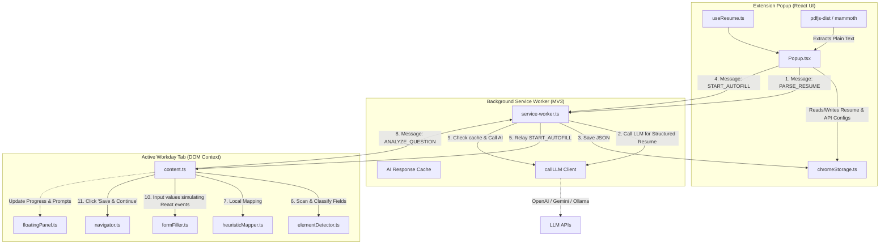
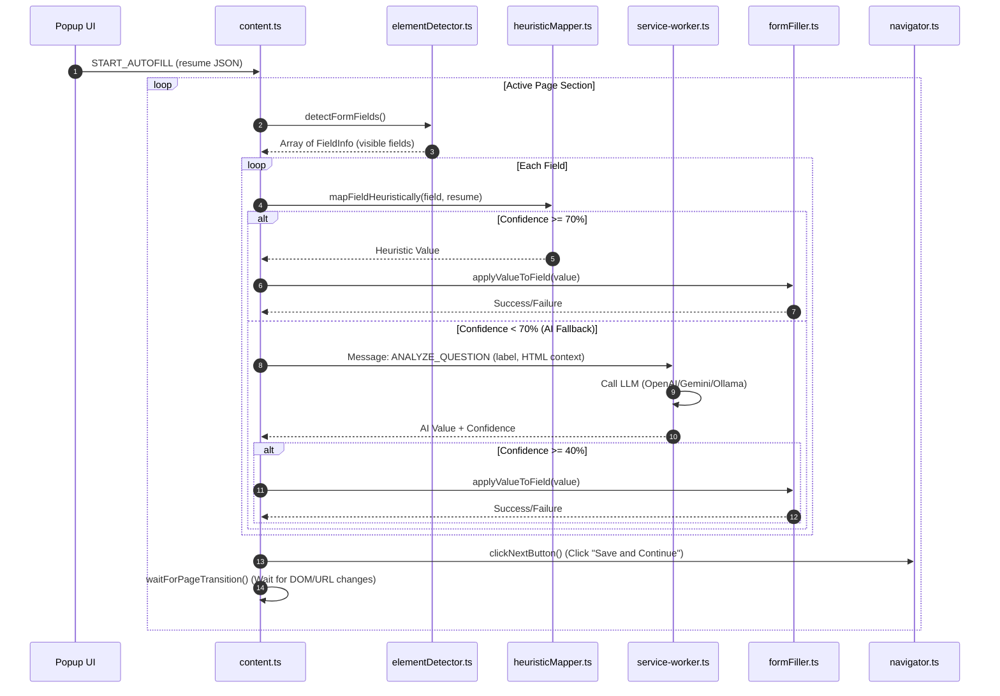

# System Design Document: Workday AI Autofill

Workday AI Autofill is a Chrome Extension designed to automate the process of completing job applications on Workday platforms. The system uses a hybrid approach: local heuristic matching for fast, deterministic mapping, and large language models (LLMs)—OpenAI, Google Gemini, or local Ollama—for complex, dynamic, or highly customized questions.

---

## 1. System Architecture Overview

The system is designed as a standard Manifest V3 Chrome Extension, split into three decoupled execution contexts:
1. **Popup UI (User Dashboard)**: Custom React dashboard running in the extension popup context.
2. **Background Service Worker (LLM Gateway & Orchestrator)**: Event-driven worker that manages AI provider API connections, prompt assembly, configurations, caching, and communications.
3. **Content Script (Autofill Engine)**: Injected directly into the host tab's DOM (`*.myworkdayjobs.com`). It handles form field detection, page navigation, heuristic evaluations, DOM parsing, and UI overlay rendering.



---

## 2. Key Components & Implementation

### A. Document Parsing & Storage (`src/popup` & `src/utils/parser.ts`)
* **Local Extraction**: To minimize backend costs and respect privacy, plain text extraction from resumes (`.pdf` or `.docx`) occurs entirely client-side inside the popup using `pdfjs-dist` (using a local worker for MV3 CSP compliance) and `mammoth` (for DOCX).
* **Metadata & Cache Storage**:
  - `resume_metadata`: Saves file descriptors (name, size, timestamp).
  - `structured_resume`: A strict JSON containing parsed personal info, skills, education, experience, certifications, and summary.
  - `ai_response_cache`: A local cache of AI-derived answers, keyed by field properties to avoid redundant LLM billing on multiple application forms.

### B. Background Service Worker (`src/background/service-worker.ts`)
* **LLM Gateways**: Wraps fetch calls to:
  - **OpenAI**: `/v1/chat/completions` supporting JSON response format.
  - **Gemini**: `/v1beta/models/...:generateContent` using `responseMimeType: 'application/json'`.
  - **Ollama**: Local `/api/chat` with dynamic loopback fallback (reserves `127.0.0.1` for Windows IPv6 localhost resolution mismatch issues).
* **Token Optimizer**: Pre-cleans instructions and formats raw text before calling LLMs.
* **Resume Parser System Prompt**: A detailed prompt outlining a strict JSON schema for extracting profile variables.
* **Field Analyzer System Prompt**: A complex ATS question-answering prompt. It handles confidence calibration (0-100), exact-option matching (verbatim selection case-insensitively), and legal/compliance field exclusion.

### C. Content Script Autofill Engine (`src/content/`)
The engine operates on a cyclic loop via `runAutofillLoop(resume)`:



* **Element Detector (`elementDetector.ts`)**: Scans the active page for form fields (`input`, `textarea`, `[role="combobox"]`, `[data-automation-id="select-selected-item"]`). It parses associated `<label>` text, placeholders, `aria-label`, descriptions, and asterisks to determine whether the field is required.
* **Heuristic Mapper (`heuristicMapper.ts`)**: Evaluates fields locally using regular expression matching against label patterns and Workday `data-automation-id` keys. If a direct match is found (e.g. `legalfirstname` -> `firstName`), it returns the value with a high confidence rating (90-98%), avoiding AI costs.
* **Form Filler (`formFiller.ts`)**: Handles complex target-based element interactions:
  - **React Event Triggers**: Normal programmatic settings are rejected by React's internal state trackers. The utility retrieves the native prototype setter (`HTMLInputElement.prototype` / `HTMLTextAreaElement.prototype`) to set the raw value and dispatches events (`input`, `change`, `blur`) directly.
  - **Keystroke Simulation (`simulateTyping`)**: For inputs, it focuses the element and types character-by-character, firing `keydown`, `keypress`, and `keyup` sequentially to ensure Workday validation rules recognize the inputs.
  - **Dropdown Selection Strategy**: To handle custom Workday select elements, it:
    1. Focuses and clicks the select combobox.
    2. Scrapes visible options from the DOM.
    3. Performs fuzzy word-overlap scoring (`findBestMatch`) to find the closest option.
    4. Clicks the matched option. If no match is found, it falls back to arrow-down keyboard navigation.
* **Navigator (`navigator.ts`)**: Locates the page step (e.g. "Contact Information", "Review Application") and clicks Workday footer navigation buttons. It also contains **`groupRepeatableFields`**, which groups elements like education and work history cards based on their relative vertical coordinates (using `getBoundingClientRect().top`) to support filling multiple chronological histories.

---

## 3. High-Fidelity Form Interactions

### A. React State Synchronization
Simply modifying `input.value` fails to update React's internal fiber node, leading to form resets upon clicking "Continue". The filler bypasses this via React's descriptor tracker:
```typescript
const valueSetter = Object.getOwnPropertyDescriptor(window.HTMLInputElement.prototype, 'value');
if (valueSetter?.set) {
  valueSetter.set.call(element, value);
} else {
  element.value = value;
}
element.dispatchEvent(new Event('input',  { bubbles: true }));
element.dispatchEvent(new Event('change', { bubbles: true }));
```

### B. DOM Context Token Reducer
To avoid bloating LLM prompts with redundant markup, the content script clones the element container and strips layout artifacts (such as classes, inline styles, `svg`, `path`, and script tags) while keeping key attributes (`id`, `name`, `placeholder`, `aria-label`, `data-automation-id`):
```typescript
const allowedAttrs = ['id', 'name', 'placeholder', 'aria-label', 'data-automation-id', 'value', 'type', 'required', 'role'];
// Recursively removes any attribute not in allowedAttrs
```
This reduces token sizes by **up to 90%**, increasing prompt speeds and decreasing API usage costs.

---

## 4. UI Injections and Custom Prompts

The codebase defines a premium-feel **Glassmorphic Floating Control Panel (`src/content/floatingPanel.ts`)** loaded into the active Workday web page to show:
- Active status and progress bars.
- Action logs directly from the content script.
- **Verification Prompts**: If the AI returns an answer with low confidence, the panel opens a drawer prompting the user to select from available options or type a custom response before proceeding.
- **Step Review Prompts**: Blocks automated navigation to allow the applicant to review the autofilled inputs before clicking "Next".

> [!NOTE]
> While `FloatingPanel` is declared and fully defined in `floatingPanel.ts`, it is currently decoupled from the main runner in `content.ts`. Integrating this overlay panel directly into the content script runtime represents a valuable area of future feature expansion.
